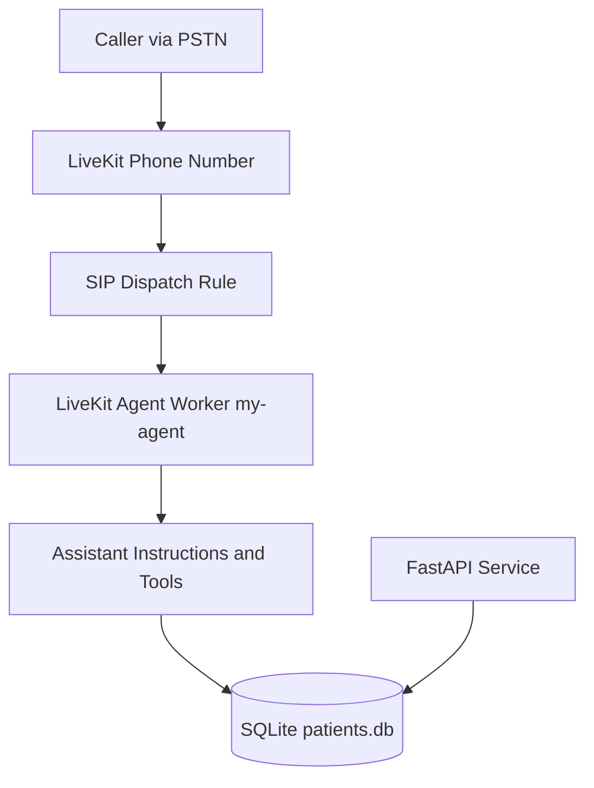

# Voice Patient Intake Agent (LiveKit + FastAPI)

This project implements a voice-based AI intake agent that can be reached by a real U.S. phone number.  
The agent collects standard patient demographics through natural conversation, confirms details before save, stores records in a persistent database, and exposes records through a REST API.

## What This Solves

- Caller dials a real phone number.
- Voice agent answers and runs a natural intake conversation (not IVR menus).
- Agent validates input and re-prompts only invalid fields.
- Agent reads data back for confirmation before final save.
- Records are persisted to `patients.db` and remain available across restarts/calls.
- Companion API allows listing and querying patient records.

## Architecture



## Tech Stack and Why

- **LiveKit Agents (Python):** real-time voice pipeline and telephony integration.
- **LiveKit Inference:** managed STT/LLM/TTS stack with minimal provider setup.
- **FastAPI:** lightweight REST service for patient record access.
- **SQLAlchemy + SQLite:** simple persistent database with typed schema and quick local setup.
- **Pydantic:** strict schema validation and input normalization.
- **uv:** fast Python package and environment management.

## Project Structure

- `src/agent.py` - voice agent entrypoint and tool logic.
- `src/api.py` - FastAPI application and endpoints.
- `src/database.py` - SQLAlchemy engine/session setup.
- `src/patient_models.py` - database table model.
- `src/patient_schemas.py` - validation and request/response schemas.
- `src/patient_service.py` - CRUD and lookup service layer.
- `tests/test_patient_api.py` - API tests.
- `.env.local` - runtime secrets and LiveKit credentials.

## Prerequisites

- Python `>=3.10` and `uv`.
- LiveKit Cloud project.
- LiveKit CLI (`lk`) installed and authenticated.
- A provisioned U.S. phone number in your LiveKit project.

Install `uv` and sync dependencies:

```powershell
uv sync
```

## Environment Variables

Create `.env.local` with:

```env
LIVEKIT_URL=wss://<your-project>.livekit.cloud
LIVEKIT_API_KEY=<your_api_key>
LIVEKIT_API_SECRET=<your_api_secret>
```

Do not commit `.env.local` to git.

## Run Locally

Download required model artifacts (first run only):

```powershell
uv run python src/agent.py download-files
```

### Agent Run Modes

- **Console test mode** (local mic/speaker):

```powershell
uv run python src/agent.py console
```

- **Development worker mode** (good while editing):

```powershell
uv run python src/agent.py dev
```

- **Telephony/production worker mode** (recommended for real calls):

```powershell
uv run python src/agent.py start
```

### Run the REST API

```powershell
uv run uvicorn src.api:app --host 0.0.0.0 --port 8000 --reload
```

## Telephony Configuration (Live Number)

1. Authenticate CLI:

```powershell
lk cloud auth
```

2. Verify your number exists:

```powershell
lk number list
```

3. Create/verify a SIP dispatch rule that routes to agent name `my-agent`.
4. Attach dispatch rule to the phone number.
5. Confirm number status is `ACTIVE` and has an attached SIP dispatch rule:

```powershell
lk number get --id <PHONE_NUMBER_ID>
lk sip dispatch list
```

6. Keep the worker running:

```powershell
uv run python src/agent.py start
```

7. Place a call to your number and run an intake flow.

## Functional Behavior Implemented

- Natural conversational demographic intake.
- Required fields:
  - `first_name`, `last_name`
  - `date_of_birth` (rejects future DOB)
  - `sex`
  - `phone_number` (must normalize to 10 digits)
  - `address_line_1`, `city`, `state`, `zip_code`
- Optional fields:
  - `email`, `address_line_2`
  - `insurance_provider`, `insurance_member_id`
  - `preferred_language`
  - `emergency_contact_name`, `emergency_contact_phone`
- Existing patient lookup by phone number.
- Confirmation read-back before create/update save.
- Graceful completion after successful save.

## Persistence

- Database file: `patients.db` (SQLite).
- Schema is defined in `src/patient_models.py`.
- Validation and normalization are enforced in `src/patient_schemas.py`.
- Data survives process restarts.

## API Endpoints

Base URL (local): `http://localhost:8000`

- `GET /health`
- `GET /patients?last_name=&date_of_birth=&phone_number=`
- `GET /patients/{patient_id}`
- `POST /patients`
- `PUT /patients/{patient_id}`
- `DELETE /patients/{patient_id}` (soft delete)

Response envelope:

```json
{ "data": {}, "error": null }
```

Validation errors:

```json
{
  "data": null,
  "error": {
    "code": "validation_error",
    "message": "Input validation failed",
    "details": []
  }
}
```

## Testing

Run tests:

```powershell
uv run python -m pytest
```

Current tests cover core patient API flows (create/read/filter/validation/delete).

## Security Notes

- Secrets are loaded from `.env.local`; no keys should be hardcoded.
- Input validation is enforced using Pydantic schemas.
- API currently has no authentication layer (acceptable for local challenge scope, not for production healthcare workloads).

## Observability

- LiveKit worker logs are emitted to stdout.
- Tool invocations and call flow events are visible in runtime logs.
- You can tail deployed agent logs using LiveKit CLI in cloud deployments.

## Deployment Notes

You can deploy this worker and API using any preferred platform (Railway/Render/Fly/AWS/GCP/etc.) as long as:

- `LIVEKIT_URL`, `LIVEKIT_API_KEY`, and `LIVEKIT_API_SECRET` are configured.
- The agent process runs continuously in `start` mode.
- The phone number remains attached to a valid SIP dispatch rule targeting `my-agent`.

## Known Limitations / Trade-offs

- SQLite is used for simplicity; PostgreSQL is recommended for multi-instance production.
- Agent behavior tests are currently lighter than a full conversational eval suite.
- API auth/rate limiting is not implemented in this challenge version.
- Some telephony quality and latency characteristics depend on network/provider conditions.

## Current Deployment Snapshot

The following values were verified via LiveKit CLI at review time:

- LiveKit project: `test-project`
- Agent ID: `CA_QNQBY455UBQM`
- Agent name: `my-agent`
- Agent region: `eu-central`
- Phone number ID: `PN_PPN_6ubbbXMpEgfN`
- Phone number (E.164): `+14844813099`
- Phone number status: `ACTIVE`
- Attached dispatch rule ID: `SDR_T3BipnwQXoX4`
- Direct dispatch target agent: `my-agent`

Note: another catch-all callee dispatch rule may also exist in the project (`SDR_Nz3BwqBVtytu`).  
The number itself is attached to `SDR_T3BipnwQXoX4` for direct routing.

## Evaluation Test Plan (Mapped to Criteria)

Use this checklist during review to validate each scoring category.

### 1) Working System (20%)

- [ ] Call `+14844813099` and complete a new registration end-to-end.
- [ ] Confirm assistant reads back fields and saves only after confirmation.
- [ ] Query API and verify new record exists:
  - `GET /patients?phone_number=<10_digit_phone>`
- [ ] Place a second call with same phone and verify existing record is found.

### 2) Conversational Quality (20%)

- [ ] Test correction handling: "My last name is D-A-V-I-S, not D-A-V-I-E-S."
- [ ] Test interruption handling while assistant is speaking.
- [ ] Test out-of-order responses (e.g., giving state before city).
- [ ] Verify assistant keeps responses concise, natural, and contextual.

### 3) Technical Architecture (20%)

- [ ] Confirm separation of concerns:
  - Voice agent logic: `src/agent.py`
  - Validation/schema: `src/patient_schemas.py`
  - Data layer: `src/patient_service.py`, `src/patient_models.py`, `src/database.py`
  - API layer: `src/api.py`
- [ ] Confirm schema constraints (types, required fields, validators) are enforced.
- [ ] Confirm API endpoints are RESTful and validated.

### 4) Code Quality and Documentation (20%)

- [ ] Run tests: `uv run python -m pytest`
- [ ] Validate README setup/deploy instructions from scratch.
- [ ] Review known limitations and trade-offs section.
- [ ] Confirm LLM system instructions are documented in `src/agent.py`.

### 5) Edge Cases and Resilience (20%)

- [ ] Invalid DOB test: future date should trigger field-specific re-prompt.
- [ ] Invalid phone test: non-10-digit input should trigger field-specific re-prompt.
- [ ] Disconnect test: hang up mid-call and ensure worker remains healthy.
- [ ] Data-write failure behavior: verify tool returns error payload and caller is not left in silence.
- [ ] Restart intent test: ask to start over and verify graceful reset behavior.

## Quick Reviewer Runbook

1. Run worker: `uv run python src/agent.py start`
2. Run API (optional): `uv run uvicorn src.api:app --host 0.0.0.0 --port 8000 --reload`
3. Call the provisioned number.
4. Register patient.
5. Call again and confirm previously stored data is available.
6. Query records with `GET /patients`.
