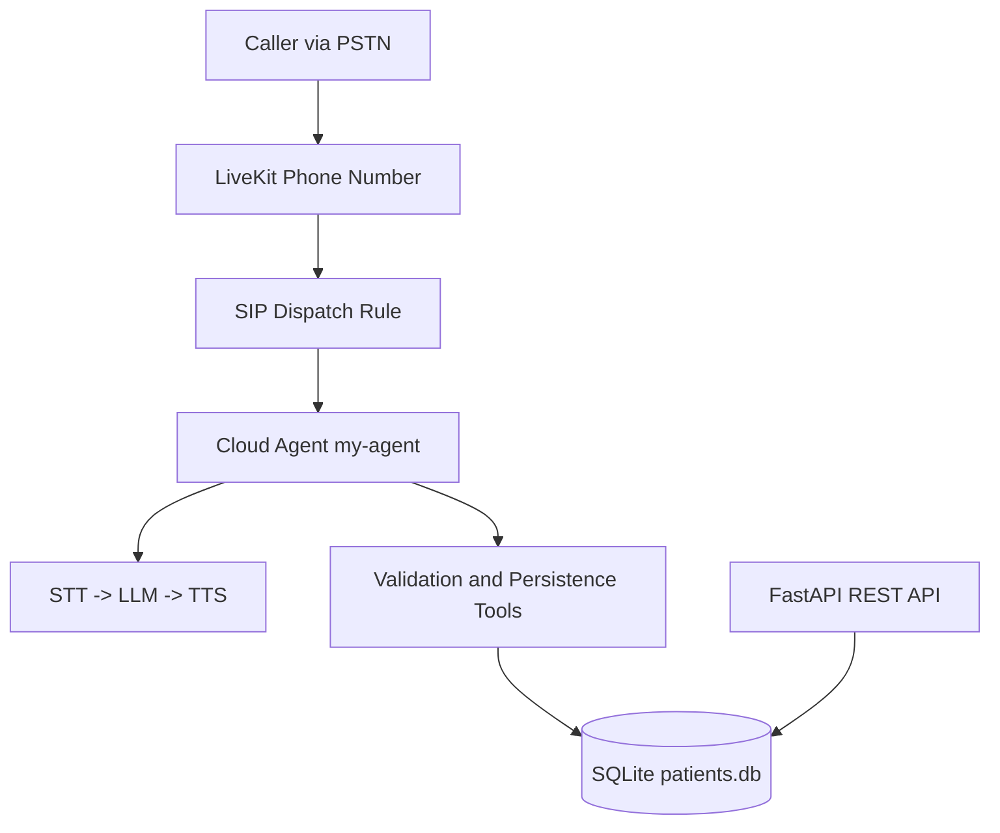

# Voice Patient Intake Agent - Submission Report

## 1. Project Overview

This submission delivers a voice-based AI patient intake agent accessible through a real U.S. phone number.  
The agent conducts natural conversation, collects and validates patient demographics, confirms details before saving, persists records to a database, and exposes data via a REST API.

## 2. Problem Statement Coverage

The system addresses the required flow:

1. Caller dials the number.
2. Agent answers and conversationally collects patient demographics.
3. Agent validates inputs and handles corrections.
4. Agent reads all collected data back to caller for confirmation.
5. Agent saves confirmed data to persistent storage.
6. Data remains available for callback sessions and API queries.

## 3. Architecture Summary



## 4. Tech Stack and Rationale

- **LiveKit Agents (Python):** real-time voice orchestration and telephony integration.
- **LiveKit Inference:** unified STT/LLM/TTS integration with managed infrastructure.
- **STT (Deepgram Nova-3):** robust transcription for phone conversations.
- **LLM (OpenAI via LiveKit Inference):** natural language intake logic and correction handling.
- **TTS (Cartesia Sonic-3):** natural-sounding voice output.
- **Silero VAD:** speech activity detection for turn timing.
- **LiveKit Turn Detector (Multilingual):** end-of-utterance prediction and smoother interactions.
- **FastAPI:** lightweight and clear REST API layer.
- **SQLAlchemy + SQLite:** persistent, structured data model with quick challenge setup.
- **Pydantic:** strict validation and input normalization.
- **uv:** fast Python dependency/runtime management.

## 5. Implemented Features

- Real inbound telephony flow via provisioned U.S. number.
- Conversational intake (non-IVR).
- Required and optional patient field collection.
- Field-level validation and targeted re-prompts.
- Existing patient lookup by phone number.
- Confirmation read-back before persistence.
- Create/update patient record tools.
- Persistent database storage across restarts/calls.
- Companion API for retrieval and updates.

## 6. Guardrails and Safety Checks

- **Prompt/behavior guardrails**
  - Ask one thing at a time.
  - Confirm before save.
  - Never fabricate tool outcomes.
- **Schema guardrails**
  - 10-digit U.S. phone normalization.
  - Date of birth parser and future-date rejection.
  - U.S. state abbreviation enforcement.
  - ZIP format validation.
  - Name format constraints.
- **API guardrails**
  - Consistent success/error envelope.
  - Structured validation errors.

## 7. Latency and Conversation Quality Strategy

- Managed low-latency pipeline components (STT/LLM/TTS).
- VAD and turn detection for responsive turn-taking.
- Preloaded plugins/models and worker warm initialization.
- Proactive initial greeting on connect to avoid caller-perceived silence.
- Short spoken prompts and focused tool usage to reduce response delay.

## 8. Deployment Snapshot

- **Project:** `test-project`
- **Agent ID:** `CA_QNQBY455UBQM`
- **Agent Name:** `my-agent`
- **Region:** `eu-central`
- **Phone Number ID:** `PN_PPN_6ubbbXMpEgfN`
- **Phone Number:** `+14844813099`
- **Phone Status:** `ACTIVE`
- **Dispatch Rule:** `SDR_T3BipnwQXoX4` (direct routing to `my-agent`)

## 9. API Surface

- `GET /health`
- `GET /patients`
- `GET /patients/{patient_id}`
- `POST /patients`
- `PUT /patients/{patient_id}`
- `DELETE /patients/{patient_id}` (soft delete)

All responses follow:

```json
{ "data": {}, "error": null }
```

## 10. Acceptance Checklist

| Category | Check | Status |
|---|---|---|
| Working System | Call number and complete new registration | Done |
| Working System | Persist and retrieve record via API | Done |
| Working System | Callback flow without data loss | Done |
| Conversational Quality | Natural conversational prompts | Done |
| Conversational Quality | Correction handling | Done |
| Conversational Quality | Confirmation before save | Done |
| Technical Architecture | Separation of concerns across voice/data/API | Done |
| Technical Architecture | Validated schema and REST endpoints | Done |
| Code Quality & Docs | README with setup, architecture, trade-offs | Done |
| Edge Cases & Resilience | Invalid input re-prompt behavior | Done |
| Edge Cases & Resilience | Disconnect handling without worker crash | Done |

## 11. Evidence Artifacts

Suggested artifacts to include with final submission:

1. Telephony dashboard screenshot showing inbound calls.
2. Cloud agent status screenshot showing running deployment.
3. Call log excerpt indicating session/job handling.
4. API query output showing persisted patient data.
5. README + this report (`SUBMISSION_REPORT.md`).

## 12. Known Limitations and Trade-offs

- SQLite is used for challenge simplicity; PostgreSQL is preferred for production scale.
- API authentication/rate limiting is not implemented in this challenge build.
- Conversational eval coverage can be expanded further beyond current API tests.
- Some perceived call quality can vary by network and telephony conditions.

## 13. How to Reproduce Reviewer Validation

1. Confirm cloud agent is running.
2. Call `+14844813099` and complete intake.
3. Call again with same phone and verify existing lookup behavior.
4. Query API (`GET /patients`) and confirm persisted record.
5. Optionally tail logs during call using LiveKit CLI for runtime verification.
